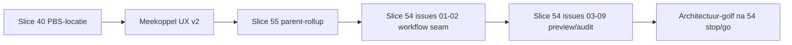

# Meekoppel traject — slice-map

**Laatst bijgewerkt:** 2026-06-02  
**Bron:** grill-me parent-rollup (2026-06-02); slice 54 PRD v0.2

## Volgorde (uitvoering)

| Slice | Map | Status (indicatief) | Afhankelijk van |
|-------|-----|---------------------|-----------------|
| **39** | `rcm-desktop-slice39-meekoppelkansen-planning-2a` | Done | 28–30 overlay |
| **40** | `rcm-desktop-slice40-meekoppel-pbs-locatie-bundeling` | Done | 39, ADR-0005 2b |
| **UX v2** | `rcm-desktop-slice-meekoppel-ux-v2` | Grotendeels done | 40 |
| **55** | `rcm-desktop-slice55-meekoppel-discovery-parent-rollup` | **Ready** | 40 |
| **54** | `rcm-desktop-slice54-meekoppel-workflow-seam` | 01–02 done; **03+ na 55** | 55 voor discovery-semantiek |
| **Architectuur** | o.a. slice 53 golf | Na 54 stop/go | — |

## Scope-grenzen

- **Slice 55:** discovery-bundelsleutel één parent hoger; scope-filter leaf-dekking; ADR-amendement; geen feature-flag.
- **Slice 54:** workflow-seam, checkbox-preview, audit — **geen** wijziging bundelniveau.
- **PBS-multi-select preview/apply:** blijft platte REV-lijst (geen auto-split per parent in slice 55).

## Acceptatie-overzicht slice 55

1. Adapter-tests (synthetische boom + fallback).
2. ADR-0005-amendement.
3. Haarlem-handcheck (checklist in `KANBAN_HANDOFF.md`).

## Na slice 54 (uitgesteld)

Workspace policy, session-seam, cache-key seam, state transitions — herprioriteren na slice 54 stop/go.
