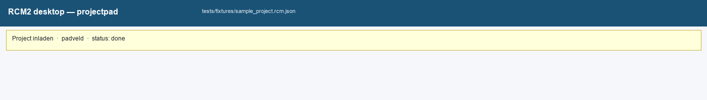
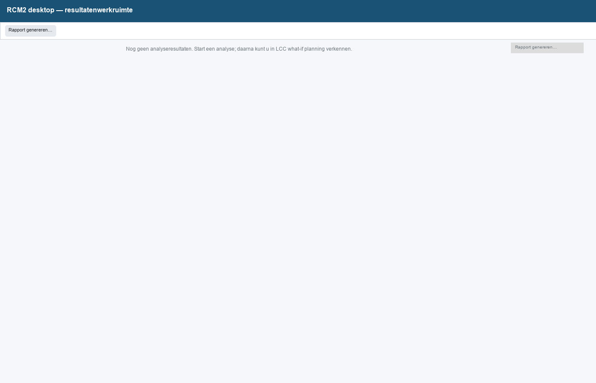
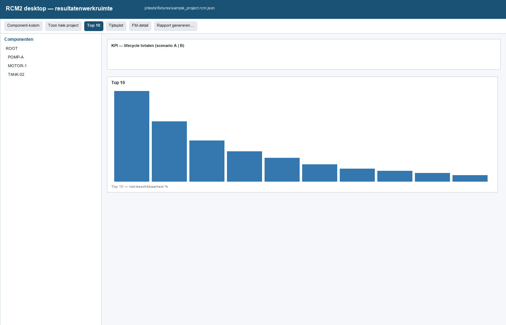
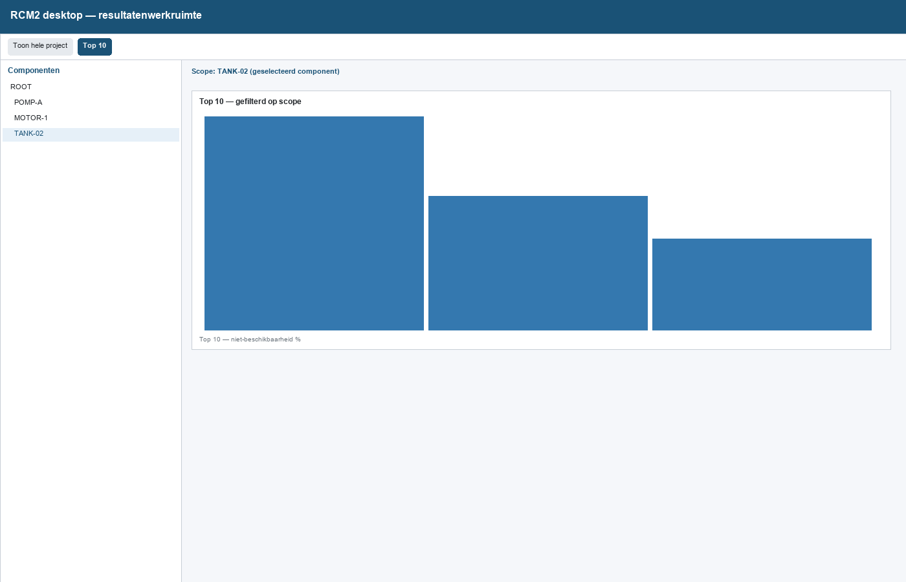
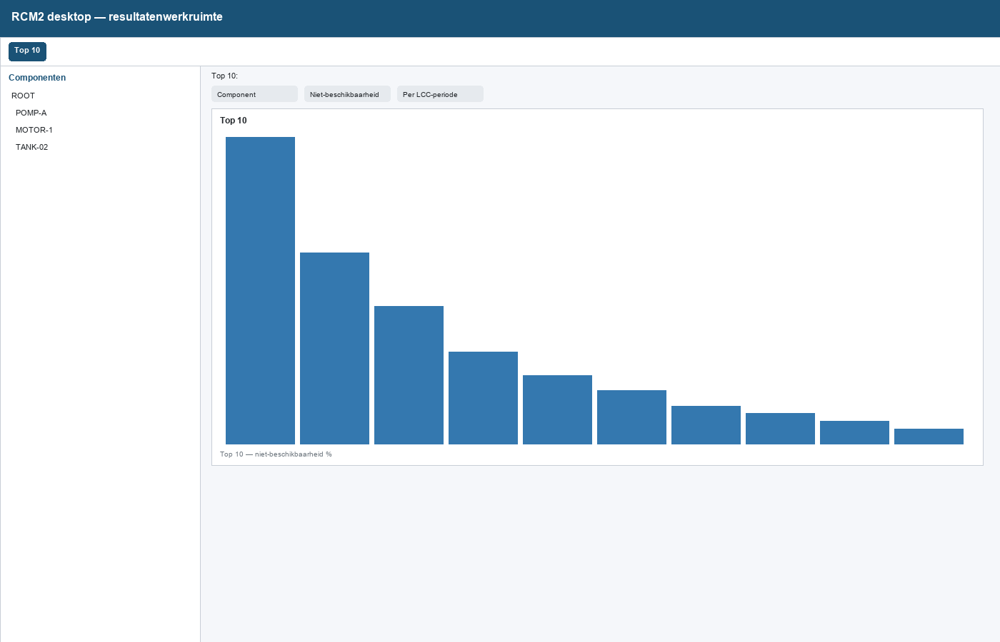
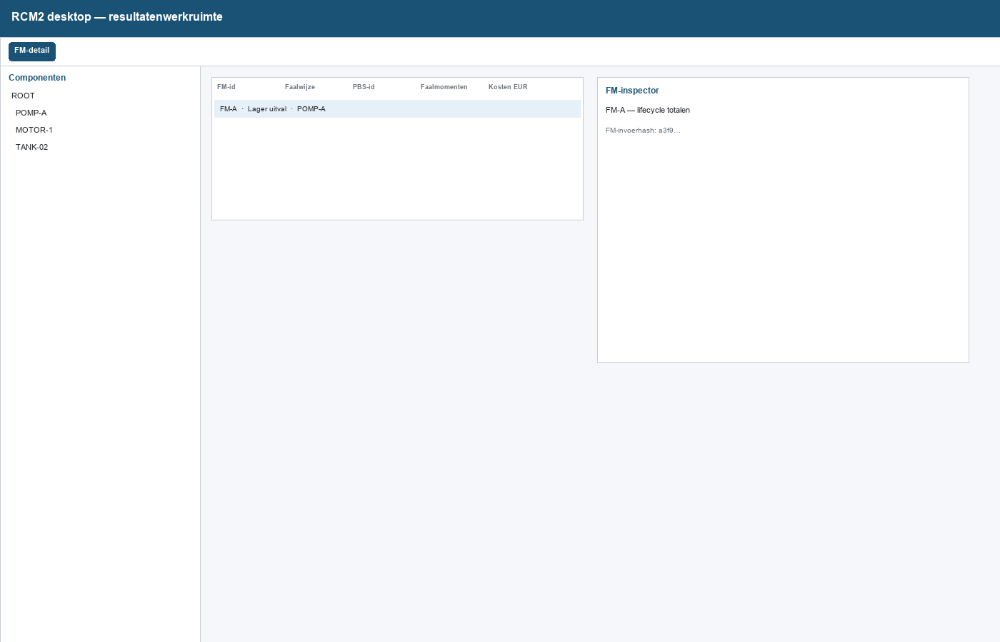
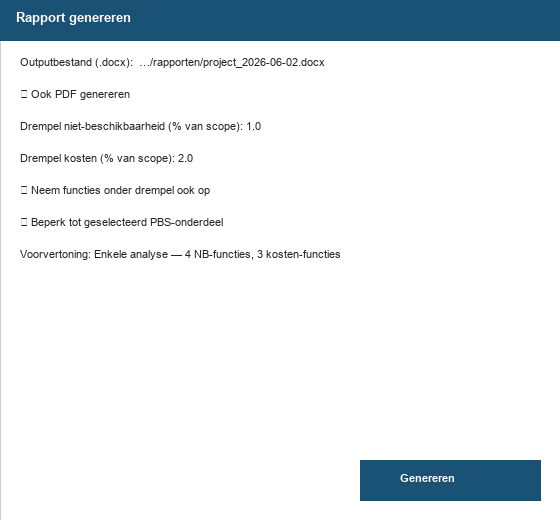
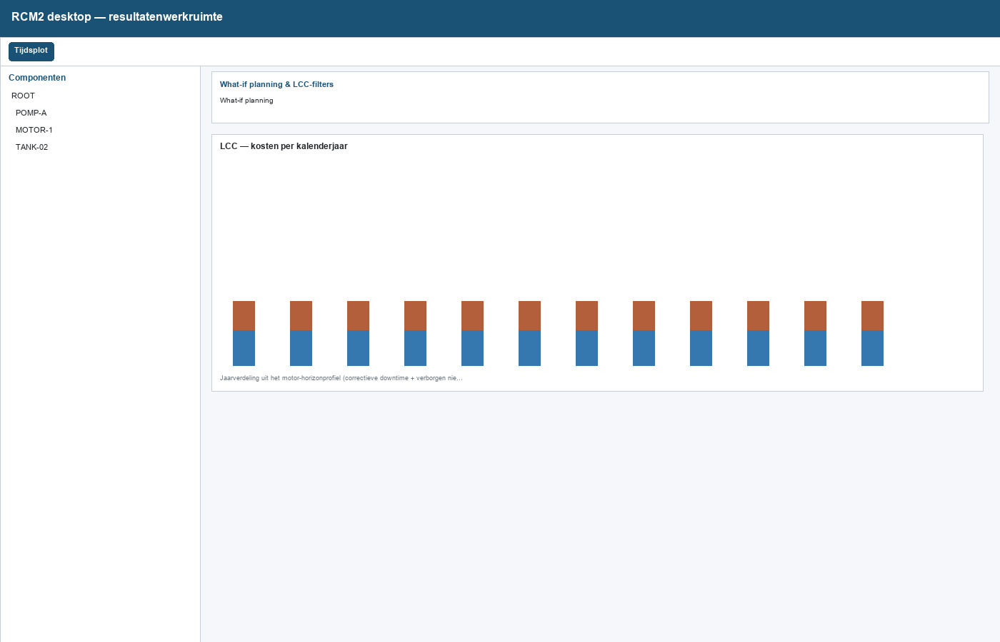

# RCM2 desktop — gebruikshandleiding (maintenance engineer)

> **Status document:** v1-skelet (inhoud uit te werken per sectie)  
> **Geldt voor applicatie:** RCM2 desktop v0.1.0  
> **Screenshots:** v0.1.0 (2026-06-02), schematisch (labels uit app; vervang bij release door `capture_gebruikershandleiding_screenshots.py` indien mogelijk)  
> **Laatste inhoudelijke update:** 2026-06-02

---

## 0. Metadata

- **Doelgroep:** maintenance engineer / reliability engineer  
- **Vereisten:** domeinkennis RCM (faalwijzen, PM, LCC); leesrechten project; optioneel bewerkrechten (Deel B)  
- **Demo-project quick start:** `tests/fixtures/awzi_haarlem_waarderpolder_demo.rcm.json`  
- **Screenshots in dit document:** gegenereerd met `sample_project.rcm.json` (kleiner demo); quick start gebruikt Haarlem-fixture  
- **Ontwikkelaarscontext:** `CONTEXT.md`, installatie: `README.md`

---

## 1. Voorwoord

### 1.1 Doel van deze handleiding

Na het doorlopen van de quick start en naslaghoofdstukken kun je:

- een project laden en een analyse-run starten;
- resultaten interpreteren in de **resultatenwerkruimte** (PBS-scope, scenario’s, drie modi);
- een gestandaardiseerd **rapport** genereren en de scope ten opzichte van de live werkruimte uitleggen;
- bij bewerkrechten: een faalwijze gecontroleerd aanpassen (Deel B).

### 1.2 Tool in ontwikkeling

RCM2 desktop evolueert nog. UI-labels en onderdelen kunnen tussen releases wijzigen. Controleer altijd de **versie in de footer** van je PDF en de regel *Screenshots: v…*.

Als het scherm afwijkt van de plaatjes: nieuwere of oudere build dan gedocumenteerd. Meld verschillen via `{issue-tracker / contact}`.

Experimentele functies (feature flags, optioneel meekoppel) staan alleen in appendix of “als van toepassing”.

### 1.3 Wat deze handleiding niet is

- Geen RCM-methodiek-cursus (Weibull, NMF-theorie, enz.).
- Geen vervanging van assetmanagement-besluitvorming over rapporten.
- Geen ontwikkelaars- of installatiehandleiding (zie `README.md`).

### 1.4 Leeswijzer

| Deel | Wanneer |
|------|---------|
| §2 Installatie | Eerste keer opzetten |
| §3 Glossarium | Bij onbekende RCM2-termen |
| §4 Quick start | Eerste werkdag, hands-on |
| §5–10 Deel A | Dagelijks analysewerk |
| §11 Deel B | Alleen met bewerkrechten |
| §12 FAQ | Bij problemen |
| §13–15 Appendix | Legacy Validate, Excel, meekoppel |

---

## 2. Installatie en eerste start (kort)

### 2.1 Vereisten

- Windows-omgeving met Python en project-dependencies (`pip install -e .[dev]` — zie `README.md`).
- **PDF uit rapport:** LibreOffice (`soffice` op PATH of standaard Windows-installatie).

### 2.2 Applicatie starten

```powershell
python -m rcm_desktop.main
```

De app opent de **resultatenwerkruimte** als hoofdscherm.

### 2.3 Project openen

1. Kies een `.rcm.json`-bestand.
2. Klik **Project inladen** (inlezen + validatie).
3. Het pad staat in het padveld in de toolbar — nodig voor o.a. rapport en cache.



### 2.4 Analyse starten

- Start een **analyse-run** na laden (volledig of incrementeel na bewerkingen).
- Onderscheid status: **laden** vs. **analyseren** in de voortgangsweergave.

Zonder geldige `done`-run blijven resultaatpanelen leeg en is **Rapport genereren…** uitgeschakeld.



---

## 3. Glossarium (RCM2-specifiek)

| Term | Uitleg |
|------|--------|
| **OTG / functie** | Niet-beschikbaarheids- of kostenfunctie (effectklasse); rapporteert per functie-hoofdstuk. |
| **PBS / component** | Project Breakdown Structure; in de UI: kolom **Componenten**. |
| **Lifecycle** | Totalen over de geconfigureerde LCC-periode. |
| **Kalenderjaar** | Jaaras in het model (`modeljaar` + horizon); gebruikt in Tijdsplot-tabellen. |
| **NB-proxy** | Jaarlijkse niet-beschikbaarheid uit het motor-horizonprofiel (presentatie); lifecycle-totalen reconciliëren met de motor. Zelfde disclaimer als in rapport-appendix. |
| **Scenario slot A / B** | Twee bevroren analyse-runs voor vergelijking over alle weergaven. |
| **Actief scenario** | Welk slot de PBS-boom en bepaalde KPI’s voeden (klik op scenario-kolom). |
| **Planning-overlay** | Live what-if in Tijdsplot-modus; rapport gebruikt **bevroren** slot-data, niet de live overlay. |
| **FM-invoerhash** | Vingerafdruk van FM-invoer; wijzigt na bewerken — controle in FM-inspector. |
| **Incrementele run** | Herberekening na FM-wijziging zonder volledige project-reset (`full_recompute=False`). |

---

## 4. Quick start (~30 min)

**Doel:** demo-project doorlopen zonder begeleiding.

### 4.1 Voorbereiding

- [ ] App gestart (`python -m rcm_desktop.main`)
- [ ] Demo: `tests/fixtures/awzi_haarlem_waarderpolder_demo.rcm.json` (of kopie in eigen map)

### 4.2 Stappen

1. **Project inladen** — demo-`.rcm.json` kiezen.
2. **Run** — wacht tot status `done` en resultaten zichtbaar zijn.
3. **Layout** — links **Componenten**, rechts detail met modusknoppen **Top 10 | Tijdsplot | FM-detail**.



4. **Component selecteren** in de boom → KPI/grafiek/tabel volgen PBS-scope.
5. **Toon hele project** — scope reset.
6. Modus **Top 10** — metric **Niet-beschikbaarheid**, bron **Component**.





7. Modus **FM-detail** — selecteer één faalwijze; lees inspector (read-only).



8. *(Optioneel)* Vul scenario **B** en vergelijk KPI-kolommen.
9. **Rapport genereren…** — controleer voorvertoning, genereer Word; PDF indien LibreOffice beschikbaar.



### 4.3 Check yourself

- [ ] Ik kan uitleggen wat PBS-scope doet.
- [ ] Ik weet dat een standaardrapport het **hele project** dekt (§10.5).
- [ ] Ik vind in §12 wat te doen bij een grijze rapportknop.

---

## 5. Deel A — Resultatenwerkruimte (overzicht)

### 5.1 Mentale model

- **Links:** navigatie **Componenten** (PBS).
- **Rechts:** inhoud volgens actieve modus.
- **Boven:** KPI-tabel met scenario-kolommen (A / B / `—`).
- **Toolbar:** modus, rapport, scope-reset.

Zie overzichtsscreenshot §4.2 stap 3.

### 5.2 Componenten-kolom

- Toggle **Component-kolom** in/uit.
- Filter: *Filter op component-id of bouwdeel…*
- Klik op knoop → **scope** op detail (Top 10, FM-tabel, …).
- **Toon hele project** → geen PBS-filter.

### 5.3 KPI-tabel en scenario’s

- Scenario-kolommen tonen waarden per slot; lege slot: `—`.
- Klik op **scenario-header** → actief scenario voor PBS-aggregaten.
- **PM-taken actief** is scenario-eigenschap.

### 5.4 Scenario A/B (vergelijken)

- Vul slot **A** en **B** met afzonderlijke runs (bevroren).
- Overlay-samenvatting op voorblad rapport (bij compare).
- Gesplitste grafiekweergave waar beschikbaar (verticaal/horizontaal).

> Oude knop “Vergelijk scenario's” in legacy Validate is geen hoofdroute meer.

---

## 6. Deel A — Modus: Top 10

### 6.1 Wanneer gebruiken

Pareto-rangschikking: welke componenten of faalwijzen dragen het meest bij aan NB, kosten of faalmomenten.

### 6.2 Subbalk

- **Component** vs. **Faalwijze**
- Horizon: **Per LCC-periode** / **Per jaar** / **Ø per jaar**
- NB: **Uren** / **%**

### 6.3 Tabel

Kolommen: **Categorie**, **Waarde**, **Aandeel %**.

### 6.4 Tips

RCM2 heeft geen automatische killer/olifant-classificatie — rangschik zelf op basis van bijdragen.

---

## 7. Deel A — Modus: Tijdsplot (LCC)

### 7.1 Wanneer gebruiken

Kosten en niet-beschikbaarheid over kalenderjaren; PM/planning-inzicht.

### 7.2 Grafiek en tabellen

- Kalenderjaar, correctief/preventief/totaal (EUR).
- NB % per kalenderjaar — met **proxy-disclaimer** in de UI.

### 7.3 Planning / what-if

- Paneel onder Tijdsplot: filters, what-if toggle, taakverschuiving.
- Live overlay ≠ rapport (§10.5).



### 7.4 KPI-paneel

In Tijdsplot-modus kun je het KPI-paneel inklappen (meer ruimte voor grafiek).

---

## 8. Deel A — Modus: FM-detail

### 8.1 Wanneer gebruiken

Eén faalwijze **verifiëren** vóór bewerken (Deel B).

### 8.2 Inspector

- Lifecycle-totalen, jaarreeks, reconcile-status.
- **FM-invoerhash** — verandert na invoerwijziging.

### 8.3 Filter

**Alle** / **Alleen NMF** (evident-filter).

### 8.4 Naar bewerken

**Dubbelklik** op rij → FM-editor (§11). Let op gedeeld PBS en gedeelde taakgroepen.

---

## 9. Deel A — Planning-overlay en what-if

### 9.1 Concept

Verschuif geplande taken in what-if; zie effect in Tijdsplot. Voor rapportage: run/slot opnieuw vastleggen — live overlay wordt niet automatisch het rapport.

### 9.2 Workflow

1. Open Tijdsplot-modus.  
2. Activeer what-if indien nodig.  
3. Pas verschuiving toe; controleer jaardetail.  
4. Na definitieve wijziging in projectdata: bewerken + run (Deel B) of nieuw scenario-slot.

### 9.3 Grenzen

Rapport reflecteert **bevroren** analyse, niet tussentijdse overlay-experimenten.

---

## 10. Deel A — Rapport genereren en begrijpen

### 10.1 Wanneer is **Rapport genereren…** beschikbaar?

- Minstens één geldige `done`-run.
- Compare-rapport: beide slots A en B gevuld.

Zonder run: knop uitgeschakeld (§2.4).

### 10.2 Dialoog

- **Outputbestand (.docx)**
- **Ook PDF genereren** (LibreOffice)
- Drempels NB / kosten; **Neem functies onder drempel ook op**
- **Beperk tot geselecteerd PBS-onderdeel** (dee-dive)
- **Voorvertoning** — aantal functiepagina’s

Zie screenshot §4.2 stap 9.

### 10.3 Fouten

- Busy: *Rapport wordt gegenereerd…*
- PDF mislukt, docx wel ok → LibreOffice installeren (§2.1, §12).

### 10.4 Rapportstructuur

| Sectie | Inhoud |
|--------|--------|
| Voorblad | Project, scenario-labels, overlay-samenvatting |
| KPI's | Lifecycle KPI's (+ Δ bij compare) |
| Project NB / LCC | Projectbrede tijdsplotten |
| Per functie | Top 10, tijdsplot, PBS Top10+rest, korte tekst |
| Appendix | NB-proxy, weggelaten functies onder drempel |

### 10.5 Belangrijk — werkruimte vs. rapport

> **Standaardrapport = heel project.**  
> PBS-scope en taaktype-filters uit de werkruimte worden **niet** stiekem meegenomen. Alleen met **Beperk tot geselecteerd PBS-onderdeel** maak je bewust een dee-dive.

### 10.6 Delen met management (kort)

Assetmanagers gebruiken vooral KPI-pagina, voorblad en projectbrede plotten. Jij levert het document; zij hoeven de app niet te bedienen.

---

## 11. Deel B — Invoer corrigeren

> **Alleen van toepassing** als je projectdata mag wijzigen.

### 11.1 Volgorde

1. Verifiëren in FM-detail (§8).  
2. Bewerken (editor of batch).  
3. Valideren + **incrementele run**.  
4. Opnieuw controleren in inspector; eventueel nieuw rapport.

### 11.2 Voorbeeld (demo-project)

1. Kies FM met onrealistische MTTF of hersteltijd.  
2. **Dubbelklik** → pas waarde aan → **OK**.  
3. Wacht op run; controleer hash en totalen in inspector.

### 11.3 FM-editor — naslag

| Sectie | Doel |
|--------|------|
| Basis | Faaltype, MTTF, NMF, startleeftijd (PBS-bouwjaar) |
| Effecten | Koppeling OTG/effectklassen |
| Correctief | CM-kosten, hersteltijd |
| Preventief | PM-taken, taakgroepen, PM-effectlinks |

Validatiefouten: volg de melding in de dialoog.

### 11.4 Batch faalwijzen-grid

Voor homogene correcties op veel FM's (zelfde veld). Bereikbaar via werkruimte-menu en legacy Validate; gedeelde bewerkingssessie.

### 11.5 Waarschuwingen

- Gedeeld **PBS** of **taakgroep** — wijziging raakt meerdere FM's.  
- Maak een backup / versiebeleid af volgens `{organisatie}`.

---

## 12. FAQ — veelvoorkomende problemen

| Symptoom | Oorzaak | Actie |
|----------|---------|-------|
| **Rapport genereren…** grijs | Geen `done`-run of compare incompleet | Run; slot B vullen (§5.4, §10.1) |
| Knop lijkt niets te doen | Geen projectpad | Pad invullen; opnieuw proberen (§2.3) |
| Alleen Word, geen PDF | LibreOffice ontbreekt | §2.1 installeren |
| Werkruimte ≠ rapport | Rapport is projectbreed | §10.5 |
| Oude cijfers na wijziging | Geen (incrementele) run | Deel B §11.1 |
| Scherm ≠ handleiding | Andere app-versie | Footer/screenshot-versie checken (§1.2) |

---

## 13. Appendix A — Legacy ValidateWindow

Gebruik alleen als organisatie dat vereist (`--legacy-validate` / `RCM_LEGACY_VALIDATE=1`):

- LTAP PM-staafdiagram en oudere cockpit-flows.
- Zelfde batch faalwijzen-grid als werkruimte.

Voor analyse en rapport: **resultatenwerkruimte** (§5–10).

---

## 14. Appendix B — Excel-import (RCM-Cost)

- Bootstrap: RCM-Cost export → `.rcm.json` via importwizard in de app.
- Zie `docs/adr/ADR-0004-isograph-excel-import-import-settings.md`.
- Detailmatrix: intern importdocumentatie (niet in deze handleiding tenzij organisatie vereist).

---

## 15. Appendix C — Meekoppel (optioneel)

> Alleen als meekoppel in jullie projecten standaard is.

- Paneel in **Tijdsplot-modus** (inklapbaar).
- Workflow: suggesties → preview → toepassen.
- Concept: `docs/adr/ADR-0005-meekoppelen-onderhoud.md`.

---

## 16. Wijzigingen per release (changelog handleiding)

| App-versie | Handleiding | Opmerking |
|------------|-------------|-----------|
| v0.1.0 | 2026-06-02 | Eerste publicatie skelet + screenshots `sample_project` |

---

## Bijlagen schrijver (niet in PDF)

- [ ] Acceptatietest §4 door niet-auteur
- [ ] FAQ-getest
- [ ] Screenshots bij tag bijgewerkt
- [ ] NB-disclaimer consistent met app/rapport
